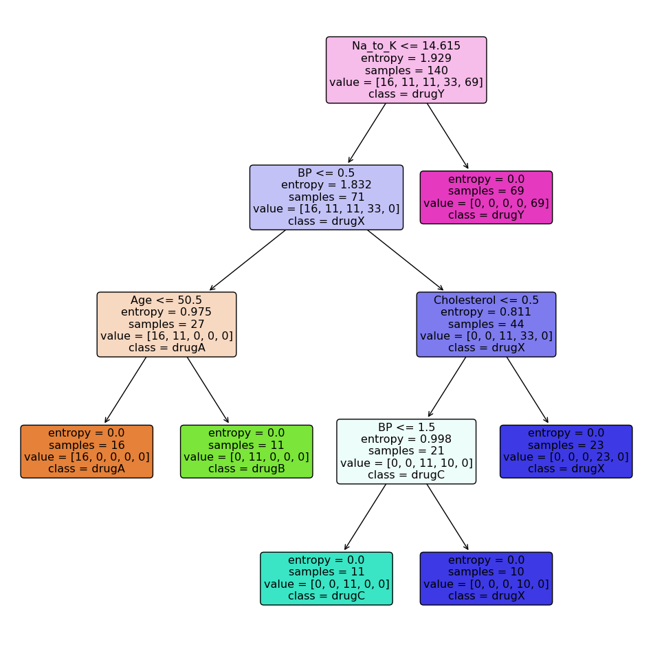
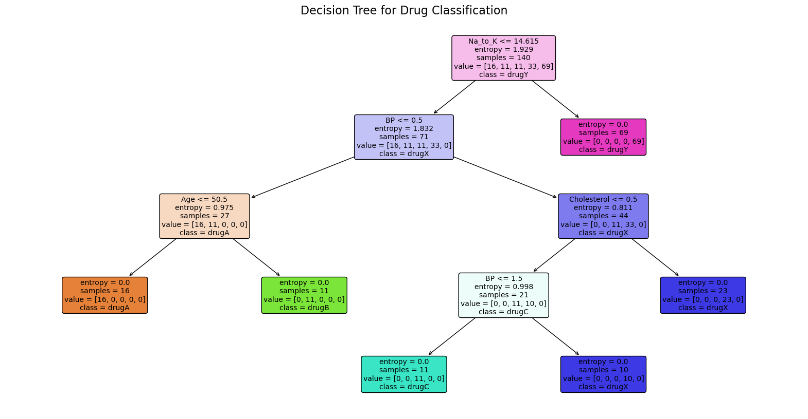
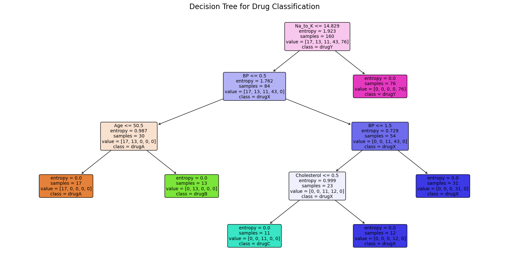

Here, we are going to use historical data of patients, and their response to different medications. Then we will use the trained decision tree to predict the class of an unknown patient, or to find a proper drug for a new patient.


```python
# Surpress warnings:
def warn(*args, **kwargs):
    pass
import warnings
warnings.warn = warn
```


```python
import sys
import numpy as np
import pandas as pd
from sklearn.tree import DecisionTreeClassifier
import sklearn.tree as tree
```

The Dataset used here is from medical research study about a set of 200 patients, all of whom suffered from the same illness. During their course of treatment, each patient responded to one of 5 medications, Drug A, Drug B, Drug c, Drug x and y. 
    Part of our job is to build a model to find out which drug might be appropriate for a future patient with the same illness. The features of this dataset are Age, Sex, Blood Pressure, and the Cholesterol of the patients, and the target is the drug that each patient responded to and then use it to predict the class of an unknown patient, or to prescribe a drug to a new patient.


```python
#Downloading the Data
my_data = pd.read_csv('https://cf-courses-data.s3.us.cloud-object-storage.appdomain.cloud/IBMDeveloperSkillsNetwork-ML0101EN-SkillsNetwork/labs/Module%203/data/drug200.csv', delimiter=",")
my_data.head(11)
```


<div>
<style scoped>
    .dataframe tbody tr th:only-of-type {
        vertical-align: middle;
    }

    .dataframe tbody tr th {
        vertical-align: top;
    }

    .dataframe thead th {
        text-align: right;
    }
</style>
<table border="1" class="dataframe">
  <thead>
    <tr style="text-align: right;">
      <th></th>
      <th>Age</th>
      <th>Sex</th>
      <th>BP</th>
      <th>Cholesterol</th>
      <th>Na_to_K</th>
      <th>Drug</th>
    </tr>
  </thead>
  <tbody>
    <tr>
      <th>0</th>
      <td>23</td>
      <td>F</td>
      <td>HIGH</td>
      <td>HIGH</td>
      <td>25.355</td>
      <td>drugY</td>
    </tr>
    <tr>
      <th>1</th>
      <td>47</td>
      <td>M</td>
      <td>LOW</td>
      <td>HIGH</td>
      <td>13.093</td>
      <td>drugC</td>
    </tr>
    <tr>
      <th>2</th>
      <td>47</td>
      <td>M</td>
      <td>LOW</td>
      <td>HIGH</td>
      <td>10.114</td>
      <td>drugC</td>
    </tr>
    <tr>
      <th>3</th>
      <td>28</td>
      <td>F</td>
      <td>NORMAL</td>
      <td>HIGH</td>
      <td>7.798</td>
      <td>drugX</td>
    </tr>
    <tr>
      <th>4</th>
      <td>61</td>
      <td>F</td>
      <td>LOW</td>
      <td>HIGH</td>
      <td>18.043</td>
      <td>drugY</td>
    </tr>
    <tr>
      <th>5</th>
      <td>22</td>
      <td>F</td>
      <td>NORMAL</td>
      <td>HIGH</td>
      <td>8.607</td>
      <td>drugX</td>
    </tr>
    <tr>
      <th>6</th>
      <td>49</td>
      <td>F</td>
      <td>NORMAL</td>
      <td>HIGH</td>
      <td>16.275</td>
      <td>drugY</td>
    </tr>
    <tr>
      <th>7</th>
      <td>41</td>
      <td>M</td>
      <td>LOW</td>
      <td>HIGH</td>
      <td>11.037</td>
      <td>drugC</td>
    </tr>
    <tr>
      <th>8</th>
      <td>60</td>
      <td>M</td>
      <td>NORMAL</td>
      <td>HIGH</td>
      <td>15.171</td>
      <td>drugY</td>
    </tr>
    <tr>
      <th>9</th>
      <td>43</td>
      <td>M</td>
      <td>LOW</td>
      <td>NORMAL</td>
      <td>19.368</td>
      <td>drugY</td>
    </tr>
    <tr>
      <th>10</th>
      <td>47</td>
      <td>F</td>
      <td>LOW</td>
      <td>HIGH</td>
      <td>11.767</td>
      <td>drugC</td>
    </tr>
  </tbody>
</table>
</div>


```python
my_data.shape
```


    (200, 6)


### Pre-processing

<div href="pre-processing">
    <h2>Pre-processing</h2>
</div>


Using <b>my_data</b> as the Drug.csv data read by pandas, declare the following variables: <br>

<ul>
    <li> <b> X </b> as the <b> Feature Matrix </b> (data of my_data) </li>
    <li> <b> y </b> as the <b> response vector </b> (target) </li>
</ul>


```python
X = my_data[['Age', 'Sex', 'BP', 'Cholesterol', 'Na_to_K']].values
X[0:5]

from sklearn import preprocessing
le_sex = preprocessing.LabelEncoder()
le_sex.fit(['F','M'])
X[:,1] = le_sex.transform(X[:,1]) 


le_BP = preprocessing.LabelEncoder()
le_BP.fit([ 'LOW', 'NORMAL', 'HIGH'])
X[:,2] = le_BP.transform(X[:,2])


le_Chol = preprocessing.LabelEncoder()
le_Chol.fit([ 'NORMAL', 'HIGH'])
X[:,3] = le_Chol.transform(X[:,3]) 

X[0:5]


```


    array([[23, 0, 0, 0, 25.355],
           [47, 1, 1, 0, 13.093],
           [47, 1, 1, 0, 10.114],
           [28, 0, 2, 0, 7.798],
           [61, 0, 1, 0, 18.043]], dtype=object)


### Setting up the Decision Tree


```python
from sklearn.model_selection import train_test_split
```


```python
y = my_data["Drug"]
y[0:5]
```


    0    drugY
    1    drugC
    2    drugC
    3    drugX
    4    drugY
    Name: Drug, dtype: object


```python
X_trainset, X_testset, y_trainset, y_testset = train_test_split(X, y, test_size=0.3, random_state=3)
```


```python
X_trainset.shape
```


    (140, 5)


```python
y_trainset.shape
```


    (140,)


```python
print('Shape of X training set {}'.format(X_trainset.shape),'&',' Size of Y training set {}'.format(y_trainset.shape))
```

    Shape of X training set (140, 5) &  Size of Y training set (140,)


```python
print('Shape of X training set {}'.format(X_testset.shape),'&',' Size of Y training set {}'.format(y_testset.shape))
```

    Shape of X training set (60, 5) &  Size of Y training set (60,)


```python
drugTree = DecisionTreeClassifier(criterion="entropy", max_depth = 4)
drugTree # it shows the default parameters
```


<style>#sk-container-id-5 {color: black;background-color: white;}#sk-container-id-5 pre{padding: 0;}#sk-container-id-5 div.sk-toggleable {background-color: white;}#sk-container-id-5 label.sk-toggleable__label {cursor: pointer;display: block;width: 100%;margin-bottom: 0;padding: 0.3em;box-sizing: border-box;text-align: center;}#sk-container-id-5 label.sk-toggleable__label-arrow:before {content: "▸";float: left;margin-right: 0.25em;color: #696969;}#sk-container-id-5 label.sk-toggleable__label-arrow:hover:before {color: black;}#sk-container-id-5 div.sk-estimator:hover label.sk-toggleable__label-arrow:before {color: black;}#sk-container-id-5 div.sk-toggleable__content {max-height: 0;max-width: 0;overflow: hidden;text-align: left;background-color: #f0f8ff;}#sk-container-id-5 div.sk-toggleable__content pre {margin: 0.2em;color: black;border-radius: 0.25em;background-color: #f0f8ff;}#sk-container-id-5 input.sk-toggleable__control:checked~div.sk-toggleable__content {max-height: 200px;max-width: 100%;overflow: auto;}#sk-container-id-5 input.sk-toggleable__control:checked~label.sk-toggleable__label-arrow:before {content: "▾";}#sk-container-id-5 div.sk-estimator input.sk-toggleable__control:checked~label.sk-toggleable__label {background-color: #d4ebff;}#sk-container-id-5 div.sk-label input.sk-toggleable__control:checked~label.sk-toggleable__label {background-color: #d4ebff;}#sk-container-id-5 input.sk-hidden--visually {border: 0;clip: rect(1px 1px 1px 1px);clip: rect(1px, 1px, 1px, 1px);height: 1px;margin: -1px;overflow: hidden;padding: 0;position: absolute;width: 1px;}#sk-container-id-5 div.sk-estimator {font-family: monospace;background-color: #f0f8ff;border: 1px dotted black;border-radius: 0.25em;box-sizing: border-box;margin-bottom: 0.5em;}#sk-container-id-5 div.sk-estimator:hover {background-color: #d4ebff;}#sk-container-id-5 div.sk-parallel-item::after {content: "";width: 100%;border-bottom: 1px solid gray;flex-grow: 1;}#sk-container-id-5 div.sk-label:hover label.sk-toggleable__label {background-color: #d4ebff;}#sk-container-id-5 div.sk-serial::before {content: "";position: absolute;border-left: 1px solid gray;box-sizing: border-box;top: 0;bottom: 0;left: 50%;z-index: 0;}#sk-container-id-5 div.sk-serial {display: flex;flex-direction: column;align-items: center;background-color: white;padding-right: 0.2em;padding-left: 0.2em;position: relative;}#sk-container-id-5 div.sk-item {position: relative;z-index: 1;}#sk-container-id-5 div.sk-parallel {display: flex;align-items: stretch;justify-content: center;background-color: white;position: relative;}#sk-container-id-5 div.sk-item::before, #sk-container-id-5 div.sk-parallel-item::before {content: "";position: absolute;border-left: 1px solid gray;box-sizing: border-box;top: 0;bottom: 0;left: 50%;z-index: -1;}#sk-container-id-5 div.sk-parallel-item {display: flex;flex-direction: column;z-index: 1;position: relative;background-color: white;}#sk-container-id-5 div.sk-parallel-item:first-child::after {align-self: flex-end;width: 50%;}#sk-container-id-5 div.sk-parallel-item:last-child::after {align-self: flex-start;width: 50%;}#sk-container-id-5 div.sk-parallel-item:only-child::after {width: 0;}#sk-container-id-5 div.sk-dashed-wrapped {border: 1px dashed gray;margin: 0 0.4em 0.5em 0.4em;box-sizing: border-box;padding-bottom: 0.4em;background-color: white;}#sk-container-id-5 div.sk-label label {font-family: monospace;font-weight: bold;display: inline-block;line-height: 1.2em;}#sk-container-id-5 div.sk-label-container {text-align: center;}#sk-container-id-5 div.sk-container {/* jupyter's `normalize.less` sets `[hidden] { display: none; }` but bootstrap.min.css set `[hidden] { display: none !important; }` so we also need the `!important` here to be able to override the default hidden behavior on the sphinx rendered scikit-learn.org. See: https://github.com/scikit-learn/scikit-learn/issues/21755 */display: inline-block !important;position: relative;}#sk-container-id-5 div.sk-text-repr-fallback {display: none;}</style><div id="sk-container-id-5" class="sk-top-container"><div class="sk-text-repr-fallback"><pre>DecisionTreeClassifier(criterion=&#x27;entropy&#x27;, max_depth=4)</pre><b>In a Jupyter environment, please rerun this cell to show the HTML representation or trust the notebook. <br />On GitHub, the HTML representation is unable to render, please try loading this page with nbviewer.org.</b></div><div class="sk-container" hidden><div class="sk-item"><div class="sk-estimator sk-toggleable"><input class="sk-toggleable__control sk-hidden--visually" id="sk-estimator-id-5" type="checkbox" checked><label for="sk-estimator-id-5" class="sk-toggleable__label sk-toggleable__label-arrow">DecisionTreeClassifier</label><div class="sk-toggleable__content"><pre>DecisionTreeClassifier(criterion=&#x27;entropy&#x27;, max_depth=4)</pre></div></div></div></div></div>


```python
drugTree.fit(X_trainset,y_trainset)
```


<style>#sk-container-id-6 {color: black;background-color: white;}#sk-container-id-6 pre{padding: 0;}#sk-container-id-6 div.sk-toggleable {background-color: white;}#sk-container-id-6 label.sk-toggleable__label {cursor: pointer;display: block;width: 100%;margin-bottom: 0;padding: 0.3em;box-sizing: border-box;text-align: center;}#sk-container-id-6 label.sk-toggleable__label-arrow:before {content: "▸";float: left;margin-right: 0.25em;color: #696969;}#sk-container-id-6 label.sk-toggleable__label-arrow:hover:before {color: black;}#sk-container-id-6 div.sk-estimator:hover label.sk-toggleable__label-arrow:before {color: black;}#sk-container-id-6 div.sk-toggleable__content {max-height: 0;max-width: 0;overflow: hidden;text-align: left;background-color: #f0f8ff;}#sk-container-id-6 div.sk-toggleable__content pre {margin: 0.2em;color: black;border-radius: 0.25em;background-color: #f0f8ff;}#sk-container-id-6 input.sk-toggleable__control:checked~div.sk-toggleable__content {max-height: 200px;max-width: 100%;overflow: auto;}#sk-container-id-6 input.sk-toggleable__control:checked~label.sk-toggleable__label-arrow:before {content: "▾";}#sk-container-id-6 div.sk-estimator input.sk-toggleable__control:checked~label.sk-toggleable__label {background-color: #d4ebff;}#sk-container-id-6 div.sk-label input.sk-toggleable__control:checked~label.sk-toggleable__label {background-color: #d4ebff;}#sk-container-id-6 input.sk-hidden--visually {border: 0;clip: rect(1px 1px 1px 1px);clip: rect(1px, 1px, 1px, 1px);height: 1px;margin: -1px;overflow: hidden;padding: 0;position: absolute;width: 1px;}#sk-container-id-6 div.sk-estimator {font-family: monospace;background-color: #f0f8ff;border: 1px dotted black;border-radius: 0.25em;box-sizing: border-box;margin-bottom: 0.5em;}#sk-container-id-6 div.sk-estimator:hover {background-color: #d4ebff;}#sk-container-id-6 div.sk-parallel-item::after {content: "";width: 100%;border-bottom: 1px solid gray;flex-grow: 1;}#sk-container-id-6 div.sk-label:hover label.sk-toggleable__label {background-color: #d4ebff;}#sk-container-id-6 div.sk-serial::before {content: "";position: absolute;border-left: 1px solid gray;box-sizing: border-box;top: 0;bottom: 0;left: 50%;z-index: 0;}#sk-container-id-6 div.sk-serial {display: flex;flex-direction: column;align-items: center;background-color: white;padding-right: 0.2em;padding-left: 0.2em;position: relative;}#sk-container-id-6 div.sk-item {position: relative;z-index: 1;}#sk-container-id-6 div.sk-parallel {display: flex;align-items: stretch;justify-content: center;background-color: white;position: relative;}#sk-container-id-6 div.sk-item::before, #sk-container-id-6 div.sk-parallel-item::before {content: "";position: absolute;border-left: 1px solid gray;box-sizing: border-box;top: 0;bottom: 0;left: 50%;z-index: -1;}#sk-container-id-6 div.sk-parallel-item {display: flex;flex-direction: column;z-index: 1;position: relative;background-color: white;}#sk-container-id-6 div.sk-parallel-item:first-child::after {align-self: flex-end;width: 50%;}#sk-container-id-6 div.sk-parallel-item:last-child::after {align-self: flex-start;width: 50%;}#sk-container-id-6 div.sk-parallel-item:only-child::after {width: 0;}#sk-container-id-6 div.sk-dashed-wrapped {border: 1px dashed gray;margin: 0 0.4em 0.5em 0.4em;box-sizing: border-box;padding-bottom: 0.4em;background-color: white;}#sk-container-id-6 div.sk-label label {font-family: monospace;font-weight: bold;display: inline-block;line-height: 1.2em;}#sk-container-id-6 div.sk-label-container {text-align: center;}#sk-container-id-6 div.sk-container {/* jupyter's `normalize.less` sets `[hidden] { display: none; }` but bootstrap.min.css set `[hidden] { display: none !important; }` so we also need the `!important` here to be able to override the default hidden behavior on the sphinx rendered scikit-learn.org. See: https://github.com/scikit-learn/scikit-learn/issues/21755 */display: inline-block !important;position: relative;}#sk-container-id-6 div.sk-text-repr-fallback {display: none;}</style><div id="sk-container-id-6" class="sk-top-container"><div class="sk-text-repr-fallback"><pre>DecisionTreeClassifier(criterion=&#x27;entropy&#x27;, max_depth=4)</pre><b>In a Jupyter environment, please rerun this cell to show the HTML representation or trust the notebook. <br />On GitHub, the HTML representation is unable to render, please try loading this page with nbviewer.org.</b></div><div class="sk-container" hidden><div class="sk-item"><div class="sk-estimator sk-toggleable"><input class="sk-toggleable__control sk-hidden--visually" id="sk-estimator-id-6" type="checkbox" checked><label for="sk-estimator-id-6" class="sk-toggleable__label sk-toggleable__label-arrow">DecisionTreeClassifier</label><div class="sk-toggleable__content"><pre>DecisionTreeClassifier(criterion=&#x27;entropy&#x27;, max_depth=4)</pre></div></div></div></div></div>


 
### Prediction


```python
predTree = drugTree.predict(X_testset)
```


```python
print (predTree [0:5])
print (y_testset [0:5])

```

    ['drugY' 'drugX' 'drugX' 'drugX' 'drugX']
    40     drugY
    51     drugX
    139    drugX
    197    drugX
    170    drugX
    Name: Drug, dtype: object


# Evaluation


```python
from sklearn import metrics
import matplotlib.pyplot as plt
print("DecisionTrees's Accuracy: ", metrics.accuracy_score(y_testset, predTree))
```

    DecisionTrees's Accuracy:  0.9833333333333333


### Visualization


```python
from sklearn.tree import plot_tree
import matplotlib.pyplot as plt

# Assuming 'drugTree' is your trained decision tree model
# Plot the decision tree
plt.figure(figsize=(12,12))  # Set the size of the figure
plot_tree(drugTree, 
          feature_names=['Age', 'Sex', 'BP', 'Cholesterol', 'Na_to_K'], 
          class_names=drugTree.classes_, 
          filled=True, 
          rounded=True)
plt.show()

```


    

    


```python
from sklearn.tree import plot_tree
import matplotlib.pyplot as plt

# Assuming 'drugTree' is your trained decision tree model
# Plot the decision tree with detailed node labels
plt.figure(figsize=(20,10))  # Set the size of the figure for better visibility
plot_tree(drugTree, 
          feature_names=['Age', 'Sex', 'BP', 'Cholesterol', 'Na_to_K'], 
          class_names=drugTree.classes_, 
          filled=True, 
          rounded=True,
          impurity=True,  # Show impurity at each node
          fontsize=10)    # Set font size for readability

# Add title and axis labels for more context
plt.title('Decision Tree for Drug Classification')
plt.xlabel('Node Depth')
plt.ylabel('Samples per Node')

# Display the plot
plt.show()

```


    

    


```python
from sklearn.tree import plot_tree
import matplotlib.pyplot as plt

# Assuming 'drugTree' is your trained decision tree model
plt.figure(figsize=(20, 10))  # Set the size of the figure for better visibility
plot_tree(drugTree, 
          feature_names=['Age', 'Sex', 'BP', 'Cholesterol', 'Na_to_K'], 
          class_names=drugTree.classes_, 
          filled=True, 
          rounded=True,
          impurity=True,  # Show impurity at each node
          fontsize=10)    # Set font size for readability

# Add title and axis labels for more context
plt.title('Decision Tree for Drug Classification', fontsize=16)
plt.xlabel('Node Depth', fontsize=12)
plt.ylabel('Samples per Node', fontsize=12)

# Save the plot as an image
plt.savefig('decision_tree.png')

# Display the plot
plt.show()

```


    

    


```python
!pip install dash
!pip install dash-bootstrap-components

```

    Requirement already satisfied: dash in /opt/conda/envs/Python-RT23.1/lib/python3.10/site-packages (2.17.1)
    Requirement already satisfied: Flask<3.1,>=1.0.4 in /opt/conda/envs/Python-RT23.1/lib/python3.10/site-packages (from dash) (3.0.3)
    Requirement already satisfied: Werkzeug<3.1 in /opt/conda/envs/Python-RT23.1/lib/python3.10/site-packages (from dash) (3.0.3)
    Requirement already satisfied: plotly>=5.0.0 in /opt/conda/envs/Python-RT23.1/lib/python3.10/site-packages (from dash) (5.9.0)
    Requirement already satisfied: dash-html-components==2.0.0 in /opt/conda/envs/Python-RT23.1/lib/python3.10/site-packages (from dash) (2.0.0)
    Requirement already satisfied: dash-core-components==2.0.0 in /opt/conda/envs/Python-RT23.1/lib/python3.10/site-packages (from dash) (2.0.0)
    Requirement already satisfied: dash-table==5.0.0 in /opt/conda/envs/Python-RT23.1/lib/python3.10/site-packages (from dash) (5.0.0)
    Requirement already satisfied: importlib-metadata in /opt/conda/envs/Python-RT23.1/lib/python3.10/site-packages (from dash) (6.0.0)
    Requirement already satisfied: typing-extensions>=4.1.1 in /opt/conda/envs/Python-RT23.1/lib/python3.10/site-packages (from dash) (4.4.0)
    Requirement already satisfied: requests in /opt/conda/envs/Python-RT23.1/lib/python3.10/site-packages (from dash) (2.31.0)
    Requirement already satisfied: retrying in /opt/conda/envs/Python-RT23.1/lib/python3.10/site-packages (from dash) (1.3.4)
    Requirement already satisfied: nest-asyncio in /opt/conda/envs/Python-RT23.1/lib/python3.10/site-packages (from dash) (1.5.5)
    Requirement already satisfied: setuptools in /opt/conda/envs/Python-RT23.1/lib/python3.10/site-packages (from dash) (65.6.3)
    Requirement already satisfied: Jinja2>=3.1.2 in /opt/conda/envs/Python-RT23.1/lib/python3.10/site-packages (from Flask<3.1,>=1.0.4->dash) (3.1.4)
    Requirement already satisfied: itsdangerous>=2.1.2 in /opt/conda/envs/Python-RT23.1/lib/python3.10/site-packages (from Flask<3.1,>=1.0.4->dash) (2.2.0)
    Requirement already satisfied: click>=8.1.3 in /opt/conda/envs/Python-RT23.1/lib/python3.10/site-packages (from Flask<3.1,>=1.0.4->dash) (8.1.7)
    Requirement already satisfied: blinker>=1.6.2 in /opt/conda/envs/Python-RT23.1/lib/python3.10/site-packages (from Flask<3.1,>=1.0.4->dash) (1.8.2)
    Requirement already satisfied: tenacity>=6.2.0 in /opt/conda/envs/Python-RT23.1/lib/python3.10/site-packages (from plotly>=5.0.0->dash) (8.0.1)
    Requirement already satisfied: MarkupSafe>=2.1.1 in /opt/conda/envs/Python-RT23.1/lib/python3.10/site-packages (from Werkzeug<3.1->dash) (2.1.1)
    Requirement already satisfied: zipp>=0.5 in /opt/conda/envs/Python-RT23.1/lib/python3.10/site-packages (from importlib-metadata->dash) (3.11.0)
    Requirement already satisfied: charset-normalizer<4,>=2 in /opt/conda/envs/Python-RT23.1/lib/python3.10/site-packages (from requests->dash) (2.0.4)
    Requirement already satisfied: idna<4,>=2.5 in /opt/conda/envs/Python-RT23.1/lib/python3.10/site-packages (from requests->dash) (3.7)
    Requirement already satisfied: urllib3<3,>=1.21.1 in /opt/conda/envs/Python-RT23.1/lib/python3.10/site-packages (from requests->dash) (1.26.18)
    Requirement already satisfied: certifi>=2017.4.17 in /opt/conda/envs/Python-RT23.1/lib/python3.10/site-packages (from requests->dash) (2024.6.2)
    Requirement already satisfied: six>=1.7.0 in /opt/conda/envs/Python-RT23.1/lib/python3.10/site-packages (from retrying->dash) (1.16.0)
    Collecting dash-bootstrap-components
      Downloading dash_bootstrap_components-1.6.0-py3-none-any.whl.metadata (5.2 kB)
    Requirement already satisfied: dash>=2.0.0 in /opt/conda/envs/Python-RT23.1/lib/python3.10/site-packages (from dash-bootstrap-components) (2.17.1)
    Requirement already satisfied: Flask<3.1,>=1.0.4 in /opt/conda/envs/Python-RT23.1/lib/python3.10/site-packages (from dash>=2.0.0->dash-bootstrap-components) (3.0.3)
    Requirement already satisfied: Werkzeug<3.1 in /opt/conda/envs/Python-RT23.1/lib/python3.10/site-packages (from dash>=2.0.0->dash-bootstrap-components) (3.0.3)
    Requirement already satisfied: plotly>=5.0.0 in /opt/conda/envs/Python-RT23.1/lib/python3.10/site-packages (from dash>=2.0.0->dash-bootstrap-components) (5.9.0)
    Requirement already satisfied: dash-html-components==2.0.0 in /opt/conda/envs/Python-RT23.1/lib/python3.10/site-packages (from dash>=2.0.0->dash-bootstrap-components) (2.0.0)
    Requirement already satisfied: dash-core-components==2.0.0 in /opt/conda/envs/Python-RT23.1/lib/python3.10/site-packages (from dash>=2.0.0->dash-bootstrap-components) (2.0.0)
    Requirement already satisfied: dash-table==5.0.0 in /opt/conda/envs/Python-RT23.1/lib/python3.10/site-packages (from dash>=2.0.0->dash-bootstrap-components) (5.0.0)
    Requirement already satisfied: importlib-metadata in /opt/conda/envs/Python-RT23.1/lib/python3.10/site-packages (from dash>=2.0.0->dash-bootstrap-components) (6.0.0)
    Requirement already satisfied: typing-extensions>=4.1.1 in /opt/conda/envs/Python-RT23.1/lib/python3.10/site-packages (from dash>=2.0.0->dash-bootstrap-components) (4.4.0)
    Requirement already satisfied: requests in /opt/conda/envs/Python-RT23.1/lib/python3.10/site-packages (from dash>=2.0.0->dash-bootstrap-components) (2.31.0)
    Requirement already satisfied: retrying in /opt/conda/envs/Python-RT23.1/lib/python3.10/site-packages (from dash>=2.0.0->dash-bootstrap-components) (1.3.4)
    Requirement already satisfied: nest-asyncio in /opt/conda/envs/Python-RT23.1/lib/python3.10/site-packages (from dash>=2.0.0->dash-bootstrap-components) (1.5.5)
    Requirement already satisfied: setuptools in /opt/conda/envs/Python-RT23.1/lib/python3.10/site-packages (from dash>=2.0.0->dash-bootstrap-components) (65.6.3)
    Requirement already satisfied: Jinja2>=3.1.2 in /opt/conda/envs/Python-RT23.1/lib/python3.10/site-packages (from Flask<3.1,>=1.0.4->dash>=2.0.0->dash-bootstrap-components) (3.1.4)
    Requirement already satisfied: itsdangerous>=2.1.2 in /opt/conda/envs/Python-RT23.1/lib/python3.10/site-packages (from Flask<3.1,>=1.0.4->dash>=2.0.0->dash-bootstrap-components) (2.2.0)
    Requirement already satisfied: click>=8.1.3 in /opt/conda/envs/Python-RT23.1/lib/python3.10/site-packages (from Flask<3.1,>=1.0.4->dash>=2.0.0->dash-bootstrap-components) (8.1.7)
    Requirement already satisfied: blinker>=1.6.2 in /opt/conda/envs/Python-RT23.1/lib/python3.10/site-packages (from Flask<3.1,>=1.0.4->dash>=2.0.0->dash-bootstrap-components) (1.8.2)
    Requirement already satisfied: tenacity>=6.2.0 in /opt/conda/envs/Python-RT23.1/lib/python3.10/site-packages (from plotly>=5.0.0->dash>=2.0.0->dash-bootstrap-components) (8.0.1)
    Requirement already satisfied: MarkupSafe>=2.1.1 in /opt/conda/envs/Python-RT23.1/lib/python3.10/site-packages (from Werkzeug<3.1->dash>=2.0.0->dash-bootstrap-components) (2.1.1)
    Requirement already satisfied: zipp>=0.5 in /opt/conda/envs/Python-RT23.1/lib/python3.10/site-packages (from importlib-metadata->dash>=2.0.0->dash-bootstrap-components) (3.11.0)
    Requirement already satisfied: charset-normalizer<4,>=2 in /opt/conda/envs/Python-RT23.1/lib/python3.10/site-packages (from requests->dash>=2.0.0->dash-bootstrap-components) (2.0.4)
    Requirement already satisfied: idna<4,>=2.5 in /opt/conda/envs/Python-RT23.1/lib/python3.10/site-packages (from requests->dash>=2.0.0->dash-bootstrap-components) (3.7)
    Requirement already satisfied: urllib3<3,>=1.21.1 in /opt/conda/envs/Python-RT23.1/lib/python3.10/site-packages (from requests->dash>=2.0.0->dash-bootstrap-components) (1.26.18)
    Requirement already satisfied: certifi>=2017.4.17 in /opt/conda/envs/Python-RT23.1/lib/python3.10/site-packages (from requests->dash>=2.0.0->dash-bootstrap-components) (2024.6.2)
    Requirement already satisfied: six>=1.7.0 in /opt/conda/envs/Python-RT23.1/lib/python3.10/site-packages (from retrying->dash>=2.0.0->dash-bootstrap-components) (1.16.0)
    Downloading dash_bootstrap_components-1.6.0-py3-none-any.whl (222 kB)
       ━━━━━━━━━━━━━━━━━━━━━━━━━━━━━━━━━━━━━━━━ 222.5/222.5 kB 7.9 MB/s eta 0:00:00
    [?25hInstalling collected packages: dash-bootstrap-components
    Successfully installed dash-bootstrap-components-1.6.0


```python
import pandas as pd
from sklearn.model_selection import train_test_split
from sklearn.preprocessing import LabelEncoder
from sklearn.tree import DecisionTreeClassifier
import joblib

# Load the dataset
df = pd.read_csv('https://cf-courses-data.s3.us.cloud-object-storage.appdomain.cloud/IBMDeveloperSkillsNetwork-ML0101EN-SkillsNetwork/labs/Module%203/data/drug200.csv')

# Encode categorical variables
le_sex = LabelEncoder()
df['Sex'] = le_sex.fit_transform(df['Sex'])

# Define features and target variable
X = df[['Age', 'Sex', 'BP', 'Cholesterol', 'Na_to_K']].values
y = df['Drug'].values

# Encode BP and Cholesterol
le_BP = LabelEncoder()
le_Chol = LabelEncoder()
X[:, 2] = le_BP.fit_transform(X[:, 2])
X[:, 3] = le_Chol.fit_transform(X[:, 3])

# Split the data
X_train, X_test, y_train, y_test = train_test_split(X, y, test_size=0.2, random_state=42)

# Train the Decision Tree model
drugTree = DecisionTreeClassifier(criterion='entropy', max_depth=4)
drugTree.fit(X_train, y_train)

# Save the model
joblib.dump(drugTree, 'drugTree_model.pkl')

print("Model saved successfully.")

```

    Model saved successfully.


```python
from sklearn.tree import plot_tree
import matplotlib.pyplot as plt
import joblib

# Load the trained decision tree model
drugTree = joblib.load('drugTree_model.pkl')

# Plot the decision tree
plt.figure(figsize=(20, 10))  # Set the size of the figure for better visibility
plot_tree(drugTree, 
          feature_names=['Age', 'Sex', 'BP', 'Cholesterol', 'Na_to_K'], 
          class_names=drugTree.classes_, 
          filled=True, 
          rounded=True,
          impurity=True,  # Show impurity at each node
          fontsize=10)    # Set font size for readability

# Add title and axis labels for more context
plt.title('Decision Tree for Drug Classification', fontsize=16)
plt.xlabel('Node Depth', fontsize=12)
plt.ylabel('Samples per Node', fontsize=12)

# Save the plot as an image in the 'assets' directory
plt.savefig('assets/decision_tree.png')

# Display the plot
plt.show()

```


    ---------------------------------------------------------------------------

    FileNotFoundError                         Traceback (most recent call last)

    Cell In[74], line 24
         21 plt.ylabel('Samples per Node', fontsize=12)
         23 # Save the plot as an image in the 'assets' directory
    ---> 24 plt.savefig('assets/decision_tree.png')
         26 # Display the plot
         27 plt.show()


    File /opt/conda/envs/Python-RT23.1/lib/python3.10/site-packages/matplotlib/pyplot.py:1023, in savefig(*args, **kwargs)
       1020 @_copy_docstring_and_deprecators(Figure.savefig)
       1021 def savefig(*args, **kwargs):
       1022     fig = gcf()
    -> 1023     res = fig.savefig(*args, **kwargs)
       1024     fig.canvas.draw_idle()  # Need this if 'transparent=True', to reset colors.
       1025     return res


    File /opt/conda/envs/Python-RT23.1/lib/python3.10/site-packages/matplotlib/figure.py:3343, in Figure.savefig(self, fname, transparent, **kwargs)
       3339     for ax in self.axes:
       3340         stack.enter_context(
       3341             ax.patch._cm_set(facecolor='none', edgecolor='none'))
    -> 3343 self.canvas.print_figure(fname, **kwargs)


    File /opt/conda/envs/Python-RT23.1/lib/python3.10/site-packages/matplotlib/backend_bases.py:2366, in FigureCanvasBase.print_figure(self, filename, dpi, facecolor, edgecolor, orientation, format, bbox_inches, pad_inches, bbox_extra_artists, backend, **kwargs)
       2362 try:
       2363     # _get_renderer may change the figure dpi (as vector formats
       2364     # force the figure dpi to 72), so we need to set it again here.
       2365     with cbook._setattr_cm(self.figure, dpi=dpi):
    -> 2366         result = print_method(
       2367             filename,
       2368             facecolor=facecolor,
       2369             edgecolor=edgecolor,
       2370             orientation=orientation,
       2371             bbox_inches_restore=_bbox_inches_restore,
       2372             **kwargs)
       2373 finally:
       2374     if bbox_inches and restore_bbox:


    File /opt/conda/envs/Python-RT23.1/lib/python3.10/site-packages/matplotlib/backend_bases.py:2232, in FigureCanvasBase._switch_canvas_and_return_print_method.<locals>.<lambda>(*args, **kwargs)
       2228     optional_kws = {  # Passed by print_figure for other renderers.
       2229         "dpi", "facecolor", "edgecolor", "orientation",
       2230         "bbox_inches_restore"}
       2231     skip = optional_kws - {*inspect.signature(meth).parameters}
    -> 2232     print_method = functools.wraps(meth)(lambda *args, **kwargs: meth(
       2233         *args, **{k: v for k, v in kwargs.items() if k not in skip}))
       2234 else:  # Let third-parties do as they see fit.
       2235     print_method = meth


    File /opt/conda/envs/Python-RT23.1/lib/python3.10/site-packages/matplotlib/backends/backend_agg.py:509, in FigureCanvasAgg.print_png(self, filename_or_obj, metadata, pil_kwargs)
        462 def print_png(self, filename_or_obj, *, metadata=None, pil_kwargs=None):
        463     """
        464     Write the figure to a PNG file.
        465 
       (...)
        507         *metadata*, including the default 'Software' key.
        508     """
    --> 509     self._print_pil(filename_or_obj, "png", pil_kwargs, metadata)


    File /opt/conda/envs/Python-RT23.1/lib/python3.10/site-packages/matplotlib/backends/backend_agg.py:458, in FigureCanvasAgg._print_pil(self, filename_or_obj, fmt, pil_kwargs, metadata)
        453 """
        454 Draw the canvas, then save it using `.image.imsave` (to which
        455 *pil_kwargs* and *metadata* are forwarded).
        456 """
        457 FigureCanvasAgg.draw(self)
    --> 458 mpl.image.imsave(
        459     filename_or_obj, self.buffer_rgba(), format=fmt, origin="upper",
        460     dpi=self.figure.dpi, metadata=metadata, pil_kwargs=pil_kwargs)


    File /opt/conda/envs/Python-RT23.1/lib/python3.10/site-packages/matplotlib/image.py:1689, in imsave(fname, arr, vmin, vmax, cmap, format, origin, dpi, metadata, pil_kwargs)
       1687 pil_kwargs.setdefault("format", format)
       1688 pil_kwargs.setdefault("dpi", (dpi, dpi))
    -> 1689 image.save(fname, **pil_kwargs)


    File /opt/conda/envs/Python-RT23.1/lib/python3.10/site-packages/PIL/Image.py:2456, in Image.save(self, fp, format, **params)
       2454         fp = builtins.open(filename, "r+b")
       2455     else:
    -> 2456         fp = builtins.open(filename, "w+b")
       2458 try:
       2459     save_handler(self, fp, filename)


    FileNotFoundError: [Errno 2] No such file or directory: '/home/wsuser/work/assets/decision_tree.png'


    

    


```python
from sklearn import metrics
import matplotlib.pyplot as plt
accuracy=metrics.accuracy_score(y_testset, predTree)
print("DecisionTrees's Accuracy: ", metrics.accuracy_score(y_testset, predTree)
```


      Cell In[71], line 4
        print("DecisionTrees's Accuracy: ", metrics.accuracy_score(y_testset, predTree)
                                                                                       ^
    SyntaxError: incomplete input


```python
import dash
from dash import dcc, html, Input, Output
import dash_bootstrap_components as dbc
import pandas as pd
from sklearn.tree import DecisionTreeClassifier
import joblib

# Load the decision tree model
drugTree = joblib.load('drugTree_model.pkl')

# Load sample data (assuming it's saved in a CSV file)
df = pd.read_csv('https://cf-courses-data.s3.us.cloud-object-storage.appdomain.cloud/IBMDeveloperSkillsNetwork-ML0101EN-SkillsNetwork/labs/Module%203/data/drug200.csv')

# Encode categorical variables (similar to the preprocessing step)
from sklearn.preprocessing import LabelEncoder
le_sex = LabelEncoder()
df['Sex'] = le_sex.fit_transform(df['Sex'])

le_BP = LabelEncoder()
le_Chol = LabelEncoder()
df['BP'] = le_BP.fit_transform(df['BP'])
df['Cholesterol'] = le_Chol.fit_transform(df['Cholesterol'])

# Initialize the Dash app
app = dash.Dash(__name__, external_stylesheets=[dbc.themes.BOOTSTRAP])

app.layout = dbc.Container([
    dbc.Row([
        dbc.Col(html.H1("Drug Recommendation Dashboard"), className="mb-4")
    ]),
    dbc.Row([
        dbc.Col([
            html.Img(src='assets/decision_tree.png', style={'width': '100%'})
        ], width=6),
        dbc.Col([
            dbc.Form([
                dbc.Row([
                    dbc.Label("Age", width=2),
                    dbc.Col(dbc.Input(id='input-age', type='number', value=50), width=10)
                ], className="mb-3"),
                dbc.Row([
                    dbc.Label("Sex", width=2),
                    dbc.Col(
                        dbc.RadioItems(
                            options=[
                                {'label': 'Male', 'value': 1},
                                {'label': 'Female', 'value': 0}
                            ],
                            value=1,
                            id='input-sex',
                            inline=True
                        ),
                        width=10
                    )
                ], className="mb-3"),
                dbc.Row([
                    dbc.Label("BP", width=2),
                    dbc.Col(
                        dbc.RadioItems(
                            options=[
                                {'label': 'HIGH', 'value': le_BP.transform(['HIGH'])[0]},
                                {'label': 'NORMAL', 'value': le_BP.transform(['NORMAL'])[0]},
                                {'label': 'LOW', 'value': le_BP.transform(['LOW'])[0]},
                            ],
                            value=le_BP.transform(['NORMAL'])[0],
                            id='input-bp',
                            inline=True
                        ),
                        width=10
                    )
                ], className="mb-3"),
                dbc.Row([
                    dbc.Label("Cholesterol", width=2),
                    dbc.Col(
                        dbc.RadioItems(
                            options=[
                                {'label': 'HIGH', 'value': le_Chol.transform(['HIGH'])[0]},
                                {'label': 'NORMAL', 'value': le_Chol.transform(['NORMAL'])[0]},
                            ],
                            value=le_Chol.transform(['NORMAL'])[0],
                            id='input-cholesterol',
                            inline=True
                        ),
                        width=10
                    )
                ], className="mb-3"),
                dbc.Row([
                    dbc.Label("Na to K ratio", width=2),
                    dbc.Col(dbc.Input(id='input-natok', type='number', value=15.0), width=10)
                ], className="mb-3"),
                dbc.Button("Predict", id='predict-button', color='primary')
            ])
        ], width=6),
    ]),
    dbc.Row([
        dbc.Col(html.H3(id='prediction-output'), className="mt-4")
    ])
])

@app.callback(
    Output('prediction-output', 'children'),
    [Input('predict-button', 'n_clicks')],
    [Input('input-age', 'value'),
     Input('input-sex', 'value'),
     Input('input-bp', 'value'),
     Input('input-cholesterol', 'value'),
     Input('input-natok', 'value')]
)
def update_prediction(n_clicks, age, sex, bp, cholesterol, natok):
    if n_clicks is None:
        return ""
    
    # Prepare the input data for prediction
    input_data = [[age, sex, bp, cholesterol, natok]]
    
    # Predict the class
    prediction = drugTree.predict(input_data)[0]
    
    return f"The recommended drug for the patient is: {prediction},\nwith the accuracy of  {100*accuracy}"
    

if __name__ == '__main__':
    app.run_server(debug=True)
```


<iframe
    width="100%"
    height="650"
    src="http://127.0.0.1:8050/"
    frameborder="0"
    allowfullscreen

></iframe>


```python
from sklearn import metrics
import matplotlib.pyplot as plt
print("DecisionTrees's Accuracy: ", metrics.accuracy_score(y_testset, predTree))
```

    DecisionTrees's Accuracy:  0.9833333333333333


```python

```
